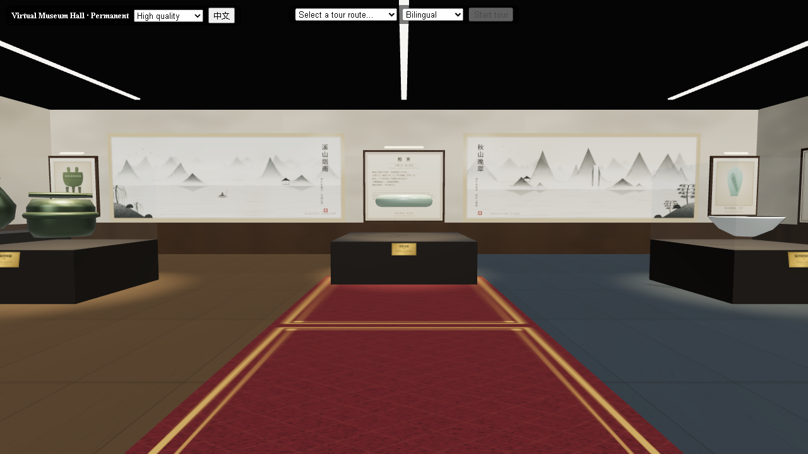
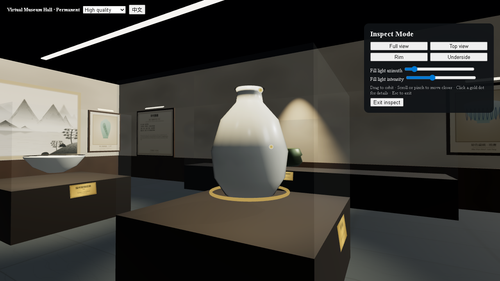

# MuseHub · 数字博物馆

[中文 README](README.md) | English

   

**MuseHub (数字博物馆)** is a lightweight, database-free virtual exhibit space for cultural artifacts that runs on desktop and mobile. All content lives as files under `content/`: drop in a JSON (and an optional GLB model) and a new artifact goes live on refresh — a ready-made 3D showcase for museums, cultural institutions, or personal collections.

Features:

- 🚶 **Free roaming** — first-person WebGL walking, mouse look, mobile virtual joystick
- 🔍 **Artifact inspection** — zoom in close, one-click camera presets (overview / top / rim / underside), golden hotspots with detail captions, adjustable fill light
- 🎧 **Guided tours** — built-in tour routes that walk, turn and narrate stop by stop with zero input; bilingual (zh/en) subtitles and audio slots
- 🌐 **Bilingual interface** — one toggle in the top-left switches Chinese / English; menus, buttons, tour bar and inspect panel all follow, and the choice is remembered. Wall didactic panels stay Chinese-primary with English notes on the same board
- 🖌 **Hall dressing** — plaster-white walls, walnut wainscot, polished marble floor with an entrance carpet; two **Chinese ink-wash landscape scrolls** on the north wall (*Misty River, Rainy Hills* and *Autumn Peaks at Dusk*, with inscriptions and seals), **bilingual didactic panels** on all four walls and six **framed artifact paintings** under picture lights
- 🖼 **Content as files** — the `content/` folder is the single source of truth; drop in a JSON/GLB and a new artifact is live

> Design specs and iteration plans live in [`docs/superpowers/`](docs/superpowers/).



## Table of contents

- [Prerequisites](#prerequisites)
- [Getting started](#getting-started)
- [Controls](#controls)
- [Content management](#content-management)
- [Project layout](#project-layout)
- [Development commands](#development-commands)
- [Configuration](#configuration)
- [FAQ](#faq)
- [Contributing](#contributing)
- [Roadmap](#roadmap)
- [License](#license)

## Prerequisites

| Item | Requirement |
|------|-------------|
| Node.js | ≥ 20 (20 LTS or newer recommended) |
| npm | Ships with Node (≥ 9) |
| Browser | A modern browser with WebGL2 (Chrome / Edge / Firefox / recent Safari); mobile needs WebGL support |
| OS | Windows / macOS / Linux all work (the `*.bat` launchers are Windows-only; use the CLI elsewhere) |

## Getting started

### Option 1: one-click scripts (Windows only)

| Script | Purpose |
|--------|---------|
| `start.bat` | Starts the server (first run auto-installs dependencies and builds the frontend) and opens the browser. **Closing the window stops the server** |
| `stop.bat` | Stops the server (cleans up by port) |
| `restart.bat` | Restarts the server |

Just double-click `start.bat` — the console shows live server logs. Default port is **3001**; override with the `PORT` environment variable:

```bat
set PORT=8080
start.bat
```

### Option 2: command line (Windows / macOS / Linux)

```bash
# 1. Install dependencies (workspace deps for frontend, backend and shared schema)
npm install

# 2a. Dev mode (hot-reloading frontend on 5173 + API on 3001) — for debugging
npm run dev

# 2b. Production mode (single port 3001; Express serves frontend + content)
npm run build
npm run start
```

Open `http://localhost:3001` in your browser to enter the hall.

## Controls

### Desktop roaming

| Action | Key / gesture |
|--------|---------------|
| Look around | Hold left mouse button and drag |
| Forward / back | `W` / `S` or `↑` / `↓` |
| Strafe left / right | `A` / `D` or `←` / `→` |
| Open artifact info panel | Click an artifact |
| Enter inspect mode | Click "进入鉴赏 / Inspect" in the info panel |

### Mobile

| Action | Gesture |
|--------|---------|
| Look around | One-finger drag |
| Walk | On-screen joystick (bottom-left) |

### Inspect mode

Click an artifact → "Inspect":

- Drag to orbit, wheel / pinch to zoom
- Toolbar presets for **overview / top / rim / underside**
- Click the **golden hotspots** for detail captions (title + body, bilingual)
- Drag the fill-light slider to reveal dark details
- `Esc` returns you to where you were roaming



### Guided tour

- Pick a route in the top bar (**Bronze Ritual** / **Song Elegance**) → "Start tour"
- The camera walks and narrates automatically; any manual input (move / look) **pauses** the tour
- The tour bar offers previous / next / pause / exit; bilingual subtitles show with the narration, and audio plays if provided

### Quality

Toggle **high / medium / low** in the top-left; mobile auto-detects and tiers down when needed.

### Language

The top-left language button toggles Chinese / English, and the choice is written to `localStorage`, so a reload keeps it. Menus follow the language; wall didactic panels and artifact plates stay Chinese-primary with English notes (the common convention in Chinese museums).

## Content management

The `content/` folder is the single source of truth (no database). Edits go live on refresh. Referential integrity is enforced by `npm test`.

### Directory layout

| Content | Path |
|---------|------|
| Hall layout & placements | `content/scenes/*.json` |
| Artifact metadata | `content/exhibits/<id>.json` |
| 3D models (optional) | `content/models/<id>.glb` |
| Tour routes | `content/routes/*.json` |
| Narration audio (optional) | `content/audio/` |
| Model download manifest | `content/models-manifest.json` |

### Add an artifact

1. Create `content/exhibits/<id>.json`, e.g. `content/exhibits/ding.json`:

```json
{
  "id": "ding",
  "name": { "zh": "青铜方鼎", "en": "Bronze Square Ding" },
  "dynasty": { "zh": "商", "en": "Shang" },
  "material": { "zh": "青铜", "en": "Bronze" },
  "summary": { "zh": "烹煮与礼器，象征权力。", "en": "A cooking and ritual vessel symbolizing power." },
  "model": "models/ding.glb",
  "procedural": "ding",
  "audio": { "zh": "audio/ding-zh.mp3", "en": "audio/ding-en.mp3" },
  "hotspots": [
    {
      "position": [0, 1.1, 0.4],
      "title": { "zh": "双立耳", "en": "Twin handles" },
      "body": { "zh": "便于穿杠抬移。", "en": "For carrying with a pole." }
    }
  ]
}
```

2. Drop `content/models/ding.glb` if you have one; **otherwise a `procedural` placeholder shape is used automatically** (allowed values: `ding` / `bell` / `hu` / `gui` / `meiping` / `bowl` / `incense` / `bi`).
3. Append one placement entry to the `exhibits` array in `content/scenes/*.json` (see "Hall layout" below).
4. Run `npm test` to validate referential integrity (`exhibitRef` must point to an existing artifact; `zone` / `caseRef` must exist).

#### Artifact fields (`content/exhibits/<id>.json`)

| Field | Type | Required | Notes |
|-------|------|----------|-------|
| `id` | string | yes | Lowercase letters / digits / hyphens, globally unique, e.g. `bianzhong` |
| `name` | `{zh, en}` | yes | Artifact name (bilingual) |
| `dynasty` | `{zh, en}` | yes | Period |
| `material` | `{zh, en}` | yes | Material |
| `summary` | `{zh, en}` | yes | One-line description |
| `model` | string | yes | Model path, must be `models/<file>.glb` (file lives under `content/models/`) |
| `procedural` | enum | no | Placeholder shape used when no GLB: `ding` / `bell` / `hu` / `gui` / `meiping` / `bowl` / `incense` / `bi` |
| `audio` | `{zh?, en?}` | no | Narration audio path (under `content/audio/`), bilingual optional |
| `hotspots` | array | no | Detail hotspots, default `[]`; each has `position:[x,y,z]`, `normal?:[x,y,z]`, `title:{zh,en}`, `body:{zh,en}` |

### Edit the hall layout (`content/scenes/*.json`)

| Field | Type | Notes |
|-------|------|-------|
| `id` / `name` | string / `{zh,en}` | Hall id and name |
| `floor` | `{width, depth, height}` | Hall size in metres; `height` defaults to `5` |
| `zones` | array | Zones: `{id, name:{zh,en}, color:"#rrggbb", bounds:{x:[min,max], z:[min,max]}}` |
| `cases` | array | Display cases: `{id, type:"freestanding"\|"wall"\|"platform", position:[x,y,z], rotationY?, size:[w,h,d]}` |
| `exhibits` | array | Placements: `{id, exhibitRef, position:[x,y,z], rotation:[x,y,z,w], zone, caseRef?}` (`rotation` is a quaternion) |
| `spawn` | `{position:[x,y,z], yaw}` | Visitor spawn point |

### Add a tour route (`content/routes/*.json`)

```json
{
  "id": "bronze-ritual",
  "title": { "zh": "青铜礼制脉络", "en": "Bronze Ritual" },
  "nodes": [
    {
      "exhibitId": "guan-ding",
      "walkTo": [-6.5, 3],
      "lookAt": [-6.5, 3],
      "subtitle": { "zh": "青铜方鼎，礼之重器。", "en": "The square ding, paramount ritual bronze." }
    }
  ]
}
```

| Field | Type | Notes |
|-------|------|-------|
| `title` | `{zh,en}` | Route name |
| `nodes` | array (≥ 2) | Each stop: `exhibitId`, `walkTo:[x,z]` (walk target, ground coords), `lookAt:[x,z]` (look target), `triggerRadius?` (default 2.5), `audio?:{zh?,en?}`, `subtitle:{zh,en}` |

### Use real 3D models

Drop a `.glb` into `content/models/<id>.glb` and point the artifact's `model` at it; `procedural` can be omitted.

**Fetch open-licensed models in bulk** (Smithsonian 3D, Sketchfab CC0, …; manifest in `content/models-manifest.json`):

```bash
node scripts/fetch-models.mjs
```

Entries with direct URLs download automatically; the rest carry a `sourceHint` for manual download into `content/models/`.

### Add narration audio

Put audio files under `content/audio/` and reference the relative path (e.g. `audio/ding-zh.mp3`) in an artifact's or route node's `audio` field. It plays in sync when the tour reaches that stop.

## Project layout

```
web/      Vite + React + Three.js frontend (src/viewer/ = pure logic + WebGL layer)
server/   Express static content server (single port for frontend + content/ + API)
shared/   Zod schemas — the single data contract shared by frontend and server
content/  scenes / exhibits / models / routes / audio / textures
scripts/  model fetching, bundle budget check
docs/     design specs and iteration plans (superpowers/)
```

## Development commands

| Command | Purpose |
|---------|---------|
| `npm run dev` | Dev mode (frontend 5173 + API 3001, hot reload) |
| `npm run build` | Build the frontend into `web/dist` |
| `npm run start` | Start in production mode (port 3001) |
| `npm test` | Full unit test suite (Vitest) |
| `npm run typecheck` | Frontend type checking |
| `node scripts/budget.mjs` | First-load bundle budget check (~202 KB gzip measured / 400 KB budget) |

## Configuration

| Variable | Default | Notes |
|----------|---------|-------|
| `PORT` | `3001` | Server listen port (Windows: `set PORT=...`; CLI: `PORT=... npm run start`) |

## FAQ

**Q: Black screen / "WebGL not available"?**
A: Use a modern browser with WebGL2 and make sure hardware acceleration is not disabled. On mobile, enable "Use GPU" in the browser settings.

**Q: Port 3001 is taken?**
A: Use `set PORT=8080` (Windows) or `PORT=8080 npm run start` (CLI) to switch; on Windows `stop.bat` cleans up by port.

**Q: New artifact doesn't show up?**
A: Make sure the JSON is valid and `npm test` passes (integrity checks); refresh the browser (production mode needs `npm run build` first).

**Q: Model not showing?**
A: Check that `model` is `models/<file>.glb` and the file is actually in `content/models/`; without a GLB the `procedural` placeholder is used.

**Q: Change hall size / case positions?**
A: Edit `floor` / `cases` / `exhibits` in `content/scenes/*.json`; coordinates are in metres, origin at hall centre, `y` is height above floor.

## Contributing

Issues and PRs are welcome. Run `npm test` and `npm run typecheck` before submitting. For larger changes, please open an issue first to discuss.

## Roadmap

- [x] Hall roaming (desktop + mobile, quality tiers, collision detection)
- [x] Inspect mode (close-up orbit, hotspots, fill light, camera presets)
- [x] Guided tours (routes, auto-walk, bilingual narration, audio slots)
- [ ] Content admin console (edit scenes/exhibits online)
- [ ] More halls and artifact packs
- [ ] GitHub Actions CI

## License

[MIT](LICENSE) — © 2026 xiangsir4088
