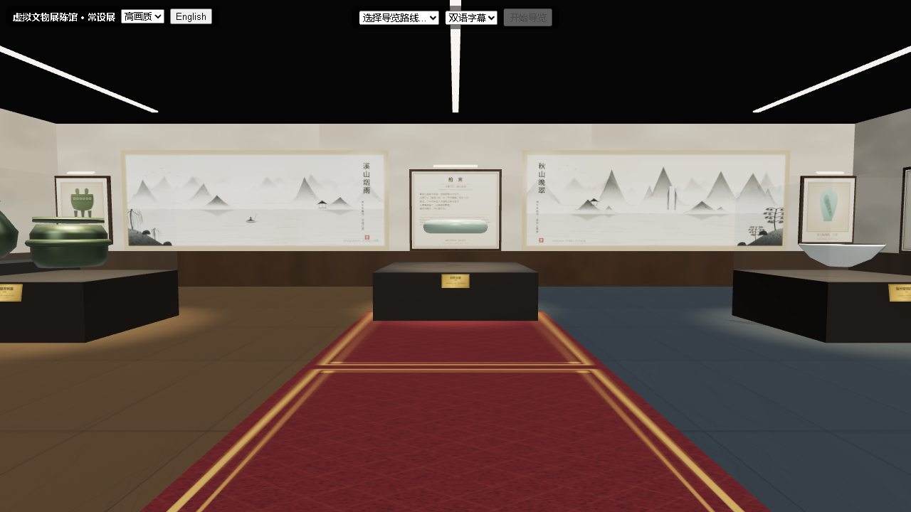
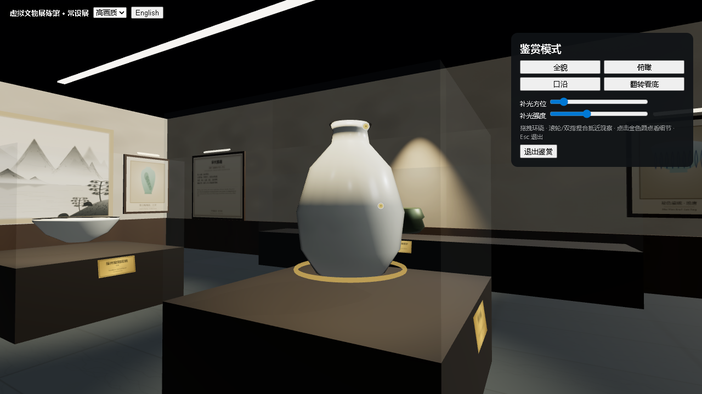

# 数字博物馆 · MuseHub

[English README](README.en.md) | 简体中文

   

**MuseHub（数字博物馆）** 是一个轻量、零数据库、跨终端的虚拟文物展示空间。所有内容以文件形式存放在 `content/` 目录，改完刷新即生效，适合作为博物馆、文博机构或个人收藏的在线 3D 展陈方案。

核心特性：

- 🚶 **自由漫游** —— WebGL 第一人称行走，鼠标环顾，移动端虚拟摇杆
- 🔍 **文物鉴赏** —— 抵近观察、四视角一键切换（全貌 / 俯瞰 / 口沿 / 翻转看底）、金色热点细节讲解、可调补光
- 🎧 **智能导览** —— 内置导览路线，零操作自动行走、转头、逐站讲解，中英双语字幕 / 配音槽位
- 🌐 **双语界面** —— 左上角一键切换中文 / English，菜单、按钮、导览条、鉴赏面板全部跟随并记忆选择；墙面讲解牌为**中文主体 + 英文附注**同屏双语
- 🖌 **展厅陈设** —— 米白石膏墙 + 胡桃木墙裙 + 抛光大理石地面与入口地毯；北墙两幅**水墨山水长卷**（《溪山烟雨》《秋山晚翠》，题款印章俱全）、四面**中英双语讲解展板**、六幅**带框文物挂画**（含射灯）
- 🖼 **内容即文件** —— `content/` 目录就是唯一数据源，放一个 JSON（可选 GLB 模型）即可上线新文物

> 设计规格与迭代计划见 [`docs/superpowers/`](docs/superpowers/)。



## 操作演示视频

[▶ 真实界面教程视频（91s）](docs/video/muse-hub-live.mp4) — 无头 Chromium 录制的真实运行画面：大厅漫游 → 青花梅瓶鉴赏（四预设视角） → 青铜礼制智能导览 → 中英一键切换，带中文配音与字幕。

<video src="docs/video/muse-hub-live.mp4" controls width="100%"></video>

## 目录

- [系统要求](#系统要求)
- [快速开始](#快速开始)
- [详细操作说明](#详细操作说明)
- [内容管理](#内容管理)
- [工程结构](#工程结构)
- [开发命令](#开发命令)
- [配置项](#配置项)
- [常见问题](#常见问题)
- [贡献指南](#贡献指南)
- [Roadmap](#roadmap)
- [License](#license)

## 系统要求

| 项目 | 要求 |
|------|------|
| Node.js | ≥ 20（推荐 20 LTS 或更高） |
| npm | 随 Node 一同安装（≥ 9） |
| 浏览器 | 支持 WebGL2 的现代浏览器（Chrome / Edge / Firefox / Safari 新版）；移动端需支持 WebGL |
| 操作系统 | Windows / macOS / Linux 均可（启动脚本 `*.bat` 为 Windows 专用，其他系统用命令行） |

## 快速开始

### 方式一：Windows 一键脚本（推荐，仅 Windows）

| 脚本 | 作用 |
|------|------|
| `start.bat` | 启动服务（首次自动安装依赖 + 构建前端），自动打开浏览器。**关闭窗口即停止服务** |
| `stop.bat` | 停止服务（按端口清理进程） |
| `restart.bat` | 重启服务 |

双击 `start.bat` 即可，控制台会显示服务日志。默认端口 **3001**，可用环境变量 `PORT` 覆盖：

```bat
set PORT=8080
start.bat
```

### 方式二：命令行（Windows / macOS / Linux）

```bash
# 1. 安装依赖（含前端、后端、共享 schema 的工作区依赖）
npm install

# 2a. 开发模式：前端热更新（5173）+ 后端 API（3001），适合调试
npm run dev

# 2b. 生产模式：单端口 3001，Express 同时托管前端与内容
npm run build
npm run start
```

启动后浏览器打开 `http://localhost:3001` 即可进入展厅。

## 详细操作说明

### PC 端漫游

| 操作 | 按键 / 手势 |
|------|------------|
| 环顾四周 | 按住鼠标左键拖拽 |
| 前进 / 后退 | `W` / `S` 或 `↑` / `↓` |
| 左移 / 右移 | `A` / `D` 或 `←` / `→` |
| 打开文物信息面板 | 鼠标点击文物 |
| 进入鉴赏模式 | 点击文物信息面板中的「进入鉴赏」 |

### 移动端

| 操作 | 手势 |
|------|------|
| 环顾 | 单指拖动 |
| 行走 | 左下角虚拟摇杆 |

### 鉴赏模式

点击文物 →「进入鉴赏」：

- 拖拽环绕观察，滚轮 / 双指缩放
- 工具条一键切换 **全貌 / 俯瞰 / 口沿 / 翻转看底** 四个预设视角
- 点击文物上的**金色热点**查看细节讲解（标题 + 正文，中英双语）
- 拖动「补光」滑块调节辅助光照，看清暗部细节
- 按 `Esc` 退回漫游时的位置



### 智能导览

- 顶栏选择路线（**青铜礼制脉络** / **宋代风雅**）→ 点击「开始导览」
- 全程自动行走、转头、逐站讲解；任意手动操作（移动 / 环顾）会**自动暂停**导览
- 导览条提供：上一站 / 下一站 / 暂停 / 退出；双语字幕随讲解显示，若有配音音频则同步播放

### 画质

左上角切换 **高 / 中 / 低** 三档；移动端检测到性能不足时自动降档。

### 语言

左上角语言按钮在 **中文 / English** 之间切换，选择写入 `localStorage`，刷新不回退。界面菜单、按钮、导览条、鉴赏面板随语言变化；墙面讲解展板与文物铭牌保持「中文为主 + 英文附注」的同屏双语排版（符合国内博物馆通行做法）。

## 内容管理

`content/` 目录即唯一数据源（无数据库），修改后刷新浏览器即生效。引用完整性由 `npm test` 强制校验。

### 目录结构

| 内容 | 路径 |
|------|------|
| 展厅布局与展位 | `content/scenes/*.json` |
| 文物元数据 | `content/exhibits/<id>.json` |
| 3D 模型（可选） | `content/models/<id>.glb` |
| 导览路线 | `content/routes/*.json` |
| 讲解音频（可选） | `content/audio/` |
| 模型下载清单 | `content/models-manifest.json` |

### 新增一件文物

1. 在 `content/exhibits/` 新建 `<id>.json`，例如 `content/exhibits/ding.json`：

```json
{
  "id": "ding",
  "name": { "zh": "青铜方鼎", "en": "Bronze Square Ding" },
  "dynasty": { "zh": "商", "en": "Shang" },
  "material": { "zh": "青铜", "en": "Bronze" },
  "summary": { "zh": "烹煮与礼器，象征权力。", "en": "A cooking and ritual vessel symbolizing power." },
  "model": "models/ding.glb",
  "procedural": "ding",
  "audio": { "zh": "audio/ding-zh.mp3", "en": "audio/ding-en.mp3" },
  "hotspots": [
    {
      "position": [0, 1.1, 0.4],
      "title": { "zh": "双立耳", "en": "Twin handles" },
      "body": { "zh": "便于穿杠抬移。", "en": "For carrying with a pole." }
    }
  ]
}
```

2. 若有 GLB 模型，放入 `content/models/ding.glb`；**缺省会自动使用 `procedural` 指定的程序化占位造型**（可选值：`ding` / `bell` / `hu` / `gui` / `meiping` / `bowl` / `incense` / `bi`）。
3. 在 `content/scenes/*.json` 的 `exhibits` 数组追加一条展位（见下方「展厅布局」字段说明）。
4. 运行 `npm test` 校验引用完整性（`exhibitRef` 必须对应已存在的文物，`zone` / `caseRef` 必须存在）。

#### 文物字段说明（`content/exhibits/<id>.json`）

| 字段 | 类型 | 必填 | 说明 |
|------|------|------|------|
| `id` | string | 是 | 小写字母 / 数字 / 连字符，全局唯一，如 `bianzhong` |
| `name` | `{zh, en}` | 是 | 文物名称（中英文） |
| `dynasty` | `{zh, en}` | 是 | 年代 |
| `material` | `{zh, en}` | 是 | 材质 |
| `summary` | `{zh, en}` | 是 | 一句话简介 |
| `model` | string | 是 | 模型路径，格式必须为 `models/<file>.glb`（文件放在 `content/models/` 下） |
| `procedural` | enum | 否 | 无 GLB 时使用的程序化占位造型：`ding` / `bell` / `hu` / `gui` / `meiping` / `bowl` / `incense` / `bi` |
| `audio` | `{zh?, en?}` | 否 | 讲解音频路径（放在 `content/audio/` 下），中英文可分别提供 |
| `hotspots` | array | 否 | 细节热点，默认 `[]`；每项含 `position:[x,y,z]`、`normal?:[x,y,z]`、`title:{zh,en}`、`body:{zh,en}` |

### 编辑展厅布局（`content/scenes/*.json`）

| 字段 | 类型 | 说明 |
|------|------|------|
| `id` / `name` | string / `{zh,en}` | 展厅标识与名称 |
| `floor` | `{width, depth, height}` | 展厅尺寸（米），`height` 默认 `5` |
| `zones` | array | 展区：`{id, name:{zh,en}, color:"#rrggbb", bounds:{x:[min,max], z:[min,max]}}` |
| `cases` | array | 展柜：`{id, type:"freestanding"\|"wall"\|"platform", position:[x,y,z], rotationY?, size:[w,h,d]}` |
| `exhibits` | array | 展位：`{id, exhibitRef, position:[x,y,z], rotation:[x,y,z,w], zone, caseRef?}`（`rotation` 为四元数） |
| `spawn` | `{position:[x,y,z], yaw}` | 访客出生点 |

### 新增导览路线（`content/routes/*.json`）

```json
{
  "id": "bronze-ritual",
  "title": { "zh": "青铜礼制脉络", "en": "Bronze Ritual" },
  "nodes": [
    {
      "exhibitId": "guan-ding",
      "walkTo": [-6.5, 3],
      "lookAt": [-6.5, 3],
      "subtitle": { "zh": "青铜方鼎，礼之重器。", "en": "The square ding, paramount ritual bronze." }
    }
  ]
}
```

| 字段 | 类型 | 说明 |
|------|------|------|
| `title` | `{zh,en}` | 路线名称 |
| `nodes` | array（≥ 2） | 每个站点：`exhibitId`、`walkTo:[x,z]`（行走目标，地面坐标）、`lookAt:[x,z]`（注视目标）、`triggerRadius?`（默认 2.5）、`audio?:{zh?,en?}`、`subtitle:{zh,en}` |

### 使用真实 3D 模型

把 `.glb` 放入 `content/models/<id>.glb`，并在文物 JSON 的 `model` 指向它即可；`procedural` 字段可省略。

**批量下载开源模型**（Smithsonian 3D、Sketchfab CC0 等，清单见 `content/models-manifest.json`）：

```bash
node scripts/fetch-models.mjs
```

有直链的条目自动下载；其余按清单中的 `sourceHint` 手动下载后放入 `content/models/`。

### 添加讲解音频

把音频文件放入 `content/audio/`，在文物或路线节点的 `audio` 字段填写相对路径（如 `audio/ding-zh.mp3`）。导览播放到该节点时同步播放。

## 工程结构

```
web/      Vite + React + Three.js 前端（src/viewer/ 为纯逻辑 + WebGL 层）
server/   Express 静态内容服务（单端口托管前端 + content/ + API）
shared/   Zod schema —— 前后端共用的唯一数据契约
content/  scenes / exhibits / models / routes / audio / textures
scripts/  模型抓取、包体预算检查
docs/     设计规格与迭代计划（superpowers/）
```

## 开发命令

| 命令 | 作用 |
|------|------|
| `npm run dev` | 开发模式（前端 5173 + 后端 API 3001，热更新） |
| `npm run build` | 构建前端到 `web/dist` |
| `npm run start` | 生产模式启动（端口 3001） |
| `npm test` | 全量单元测试（Vitest） |
| `npm run typecheck` | 前端类型检查 |
| `node scripts/budget.mjs` | 首屏包体预算校验（实测 ~202 KB gzip / 预算 400 KB） |

## 配置项

| 变量 | 默认值 | 说明 |
|------|--------|------|
| `PORT` | `3001` | 服务监听端口（Windows 脚本用 `set PORT=...`，命令行用 `PORT=... npm run start`） |

## 常见问题

**Q：打开是黑屏 / 提示 WebGL 不可用？**
A：请使用支持 WebGL2 的现代浏览器，并确认未禁用硬件加速。移动端请在浏览器设置中开启「使用 GPU」。

**Q：端口 3001 被占用？**
A：用 `set PORT=8080`（Windows）或 `PORT=8080 npm run start`（命令行）换端口；Windows 下 `stop.bat` 会按端口清理进程。

**Q：新增文物后页面没变化？**
A：确认 JSON 合法且 `npm test` 通过（引用完整性校验）；刷新浏览器（生产模式需先 `npm run build`）。

**Q：模型没显示？**
A：检查 `model` 路径是否为 `models/<file>.glb` 且文件确实在 `content/models/`；未提供 GLB 时会用 `procedural` 占位造型。

**Q：想换展厅尺寸 / 展柜位置？**
A：编辑 `content/scenes/*.json` 的 `floor` / `cases` / `exhibits`；坐标单位为米，原点在展厅中心、`y` 为离地高度。

## 贡献指南

欢迎 Issue 与 PR。提交前请运行 `npm test` 与 `npm run typecheck`。重大改动建议先开 Issue 讨论。

## Roadmap

- [x] 展厅漫游（PC + 移动端、画质分档、碰撞检测）
- [x] 鉴赏模式（抵近观察、热点、补光、四视角）
- [x] 智能导览（路线、自动行走、双语讲解、音频槽位）
- [ ] 内容管理后台（在线编辑 scenes/exhibits）
- [ ] 更多展厅与文物内容包
- [ ] GitHub Actions 自动测试

## License

[MIT](LICENSE) —— © 2026 xiangsir4088
